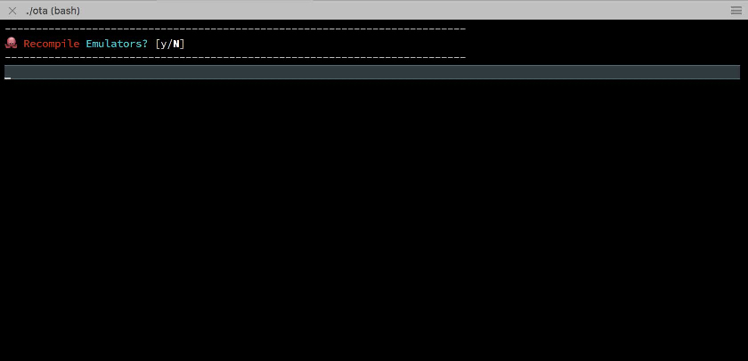
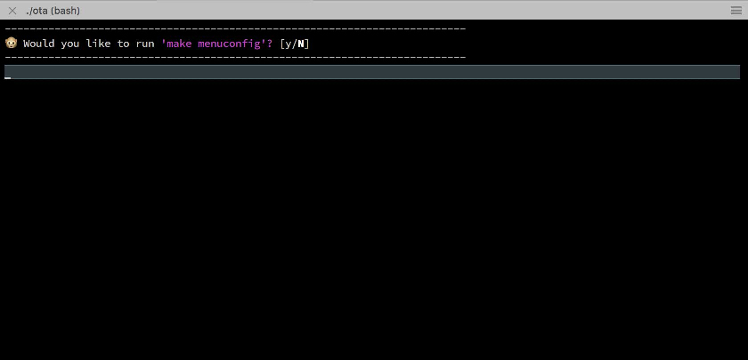
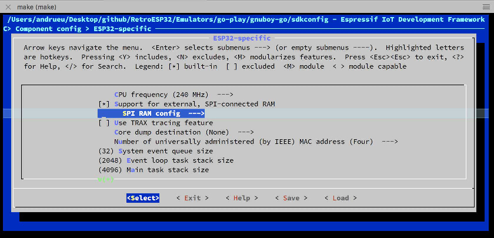
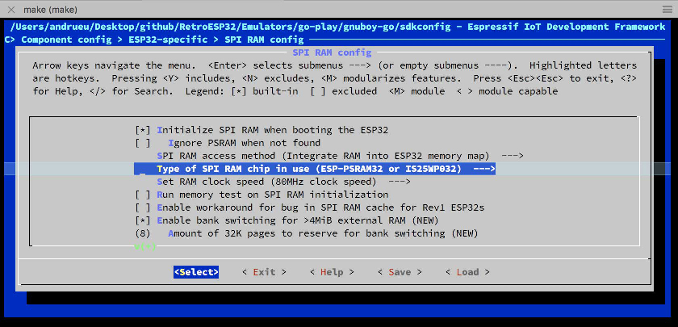
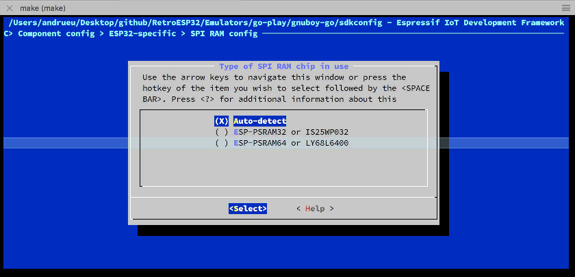
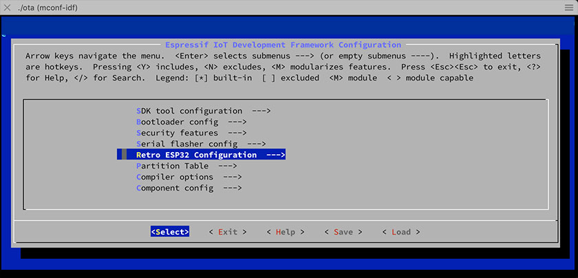
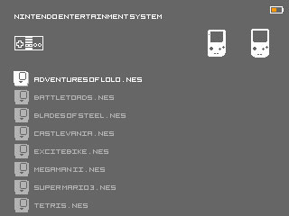

# 
> Software Branch

[](https://github.com/retro-esp32/RetroESP32/releases/latest)
[![Downloads](https://img.shields.io/github/downloads/retro-esp32/RetroESP32/total?style=for-the-badge&color=hotpink&logo=)](https://github.com/retro-esp32/RetroESP32/releases/latest)
[]()
------

## Launcher

This branch contains the specific modification for the Odroid Go hardware to use the 320x240 ILI9342 2.6" and 240x320 ILI9341 display

- [x] Odroid Go - [Firmware](https://github.com/OtherCrashOverride/odroid-go-firmware)
- [x] ROM Management
- [x] Config for both ILI9341/2

## Supported Emulators
> What else do you need to know, there are 11 currently supported

- [x] Nintendo Entertainment System
- [x] Nintendo Game Boy
- [x] Nintendo Game Boy Color
- [x] Sega Master System
- [x] Sega Game Gear
- [x] Colecovision
- [x] Sinclair Zx Spectrum 48k
- [x] Atari 2600
- [x] Atari 7800
- [x] Atari Lynx
- [x] PC Engine
- [ ] Commodore 64
- [ ] Nintendo Game & Watch

# Usage
> How To

Clone the Software Branch of the [Official Retro ESP32](https://github.com/retro-esp32/RetroESP32/)

```shell
git clone -b Software --single-branch git@github.com:retro-esp32/RetroESP32.git --recursive

cd RetroESP32

git submodule update --init --recursive

git submodule foreach git pull origin master

chmod -R 777 Scripts

cd Scripts

./installer
```
It will take a while since we run a few ```git submodule``` inside the repository

# Setup Toolchain
> You will need the xtensa esp32 toolchain

### Guides

***Note:*** You only need to install the xtensa toolchain. The esp-idf is included in this repository.

- [Linux](https://docs.espressif.com/projects/esp-idf/en/latest/get-started/linux-setup.html)
- [Mac OS](https://docs.espressif.com/projects/esp-idf/en/latest/get-started/macos-setup.html)
- [Windows](https://docs.espressif.com/projects/esp-idf/en/latest/get-started/windows-setup-scratch.html)


# Bash Scripts
> Some tools to help you along your way

Navigate to you newly cloned repository and execute the following
```
chmod -R 777 Scripts
cd Scripts
```

***Note:*** All bash scripts **MUST** be executed from the Scripts folder.


### Submodule Branches
> Make sure all the submodules are on the right branches

```
./branches
```

### Replace files for ILI9342 drivers
> Copy relevant files for ILI9342 TFT LCD

```
./replace
```

### ESP32 Environment Installer
> Install all thing necessary (NIX/OS X)  *Windows Coming Soon*

```
./installer
```

### Environmanet Variables
> Set all your paths
Be sure to run installer first

```
source ./helpers/paths
```

### Build Firmware
> Follow Onscreen Prompts
> if this is your first time running the executable, answer **Y** to the options

```
./firmware
```

You will now have a file called **Retro ESP32.fw** in the Firmware/Release folder.

You can copy this onto your *SD Card* into the ***odroid/firmware*** folder

##### Enabling new firmware
> Insert the sd card into your Retro ESP32 /  (Odroid Go) and follow the prompts

| List | Selection                    | Verification     |    Write  |    Reboot   |
| ----------------------------------------- | -------------------------------- | ---- | ---- | ---- |
|  |  |      |  |    |

### Build and Load OTA
> Follow Onscreen Prompts
> if this is your first time running the executable, answer **Y** to the applicable options

### OTA
> Flash directly to ESP32

This is the easiest option, simple follow the onscreen prompts!

```
./ota
```

*note:*

You will need to set the SPI ram for the emulators

| Screen Grab | Instructions |
| ---- |---- |
|  |   Answer **Y**   |
|  |   Answer **N**   |
|  |   Answer **Y** (This is IMPORTANT)   |
|  |   Navigate to ```Component config -->```   |
|  |   Navigate to ```ESP32-specific -->```   |
|  |   Navigate to ```SPI RAM config -->```   |
|  |   Navigate to ```Type of SPI RAM chip in use (some value) -->```   |
|  |   Select ```Auto-detect```   |


### Erase

> Erase flash and storage from ESP32

```
./erase
```

### Arduino
> Create Firmware from Arduino ```.ino.bin``` file

```
./arduino
```

You will now have a ```.fw``` file in Arduino/firmware folder.

You can copy this onto your *SD Card* into the ***odroid/firmware*** folder


### 
# Retro ESP32
> Software Branch

Finally a new launcher for your Odroid-Go

```
cd Launchers/retro-esp32
make menuconfig
```

1. Select ```Restro ESP32 Configuration``` 

2. Select your options
  * *Select* **LCD Driver Chip**
  * *Select* **MENU Key Options**
  * *Select* **In Game Menu**

3. Run ```./ota```  (see above)

|   Splash   |   Navigation   |   ROM State Management   |   Run   |
| ---- | ---- | ---- | ---- |
|      |     |     |     |

### Support
> We Like Coffee!

[](https://github.com/sponsors/32teeth)